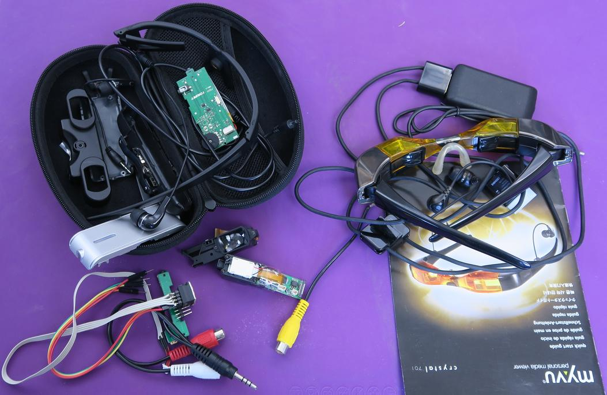
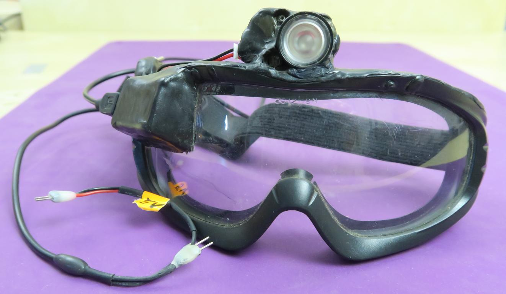
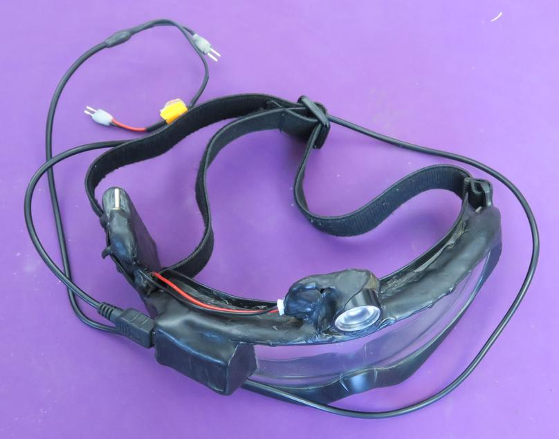
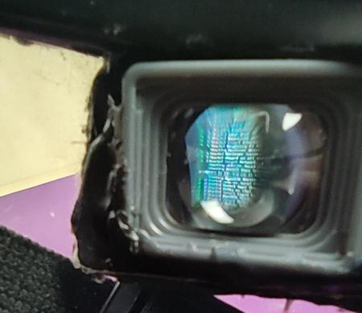
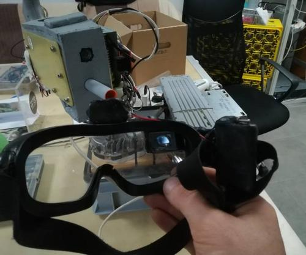

## Pierwsze kroki

Lata temu najbliższe temu co chcę, to były "wideookulary" - pary mikroekraników przed oczyma. 
Pomysł więc był by zostawić jeden ekranik, okrojony ze zbędnych elementów.

Znalazłem "myvu crystal 701", optimum ceny i jakości, rozdzielczość prawdziwe 640x480, szok! ;) 
Kupiłem z USA, przez urząd celny zębami zgrzytałem, przetestowałem i rozebrałem... **PO** wcześnieszej zabawie z dużo **tańszymi** wideookularami, które rozłożyłem, polutowałem, i stopniowo zmniejszałem do pożądanego kształtu... aż **zepsułem** pominąwszy kabelek który ukrywał opornik.

Uboższy w portfelu ale bogatszy w doświadczeniu, zabrałem się za te droższe wideookulary.
Efekt niestety taki sam: **spalona elektronika**.

## Pierwszy prototyp

Przewijamy do **2019**: kupiłem **ekranik FPV do kontroli dronów**, i [wmontowałem w gogle ochronne](https://wiki.hs3.pl/projekty/nerf_turret#wideo-gogle). 

Sukces!

Miałem z tego podgląd do sterowanego joystickiem działka NERF! 

Nawet odrobinę podobne do tego co chciałem. 
Nadaje się do noszenia w warsztacie, i na larpie Old Town :) Ale nie na co dzień. 
Ekraniki zniknęły ze sprzedaży bez śladu. 

### Teraz

W **2020** kupiłem inny mikroekranik, chyba z podglądu jakiegoś cyfrowego aparatu fotograficznego. 
Znaleź takie można czasem u chińskich sprzedawców online, szukaj "display, fpv, viewfinder"; od \$50 można dostać. 
Różnią się bardzo od siebie, nie potrafię pomóc, ten nawet ma zatarte oznaczenie procka. 

Trzykrotnie mniejszy od tego pierwszego, lepszy obraz (nie wiem jaka rozdzielczość, w podane nigdy nie wierzę), regulacja ostrości i jasności!

### [I zaczynamy :)](03_Makieta.md)