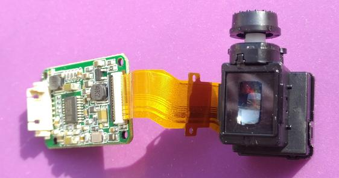
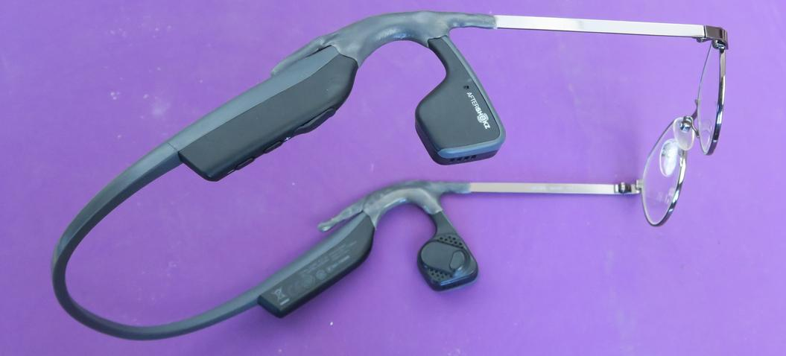
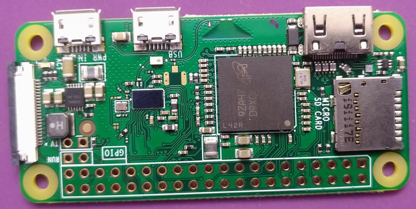
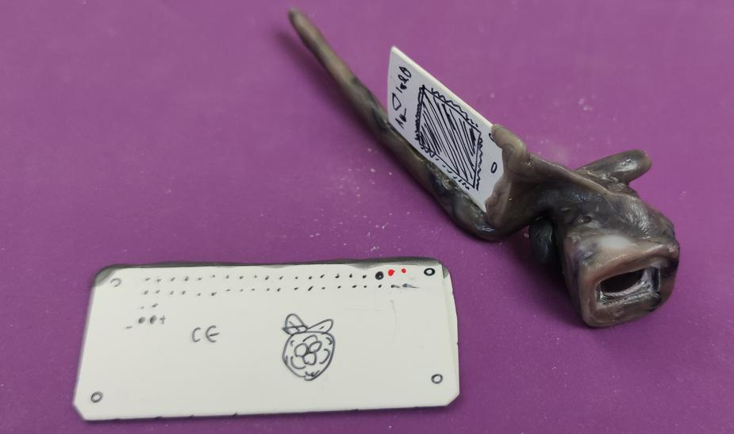
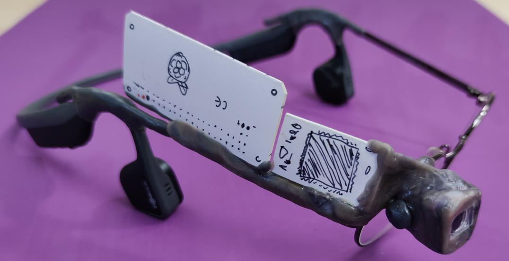
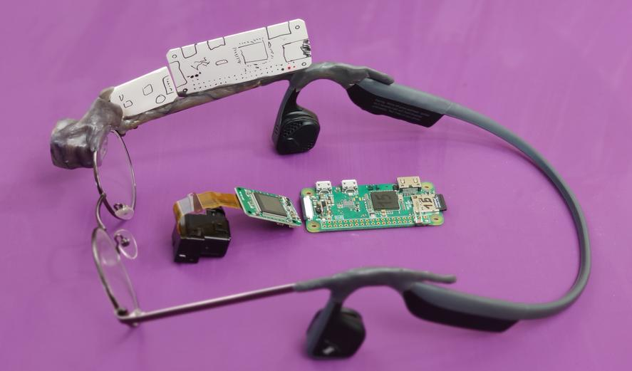
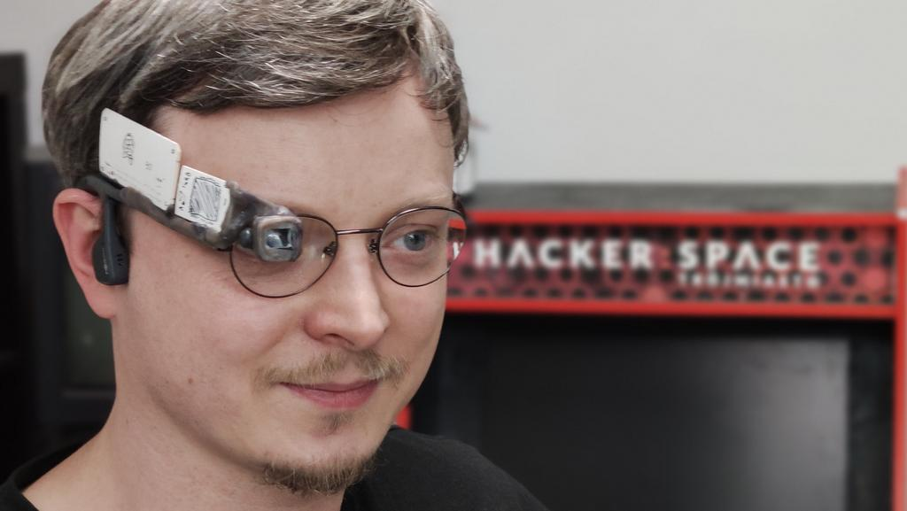
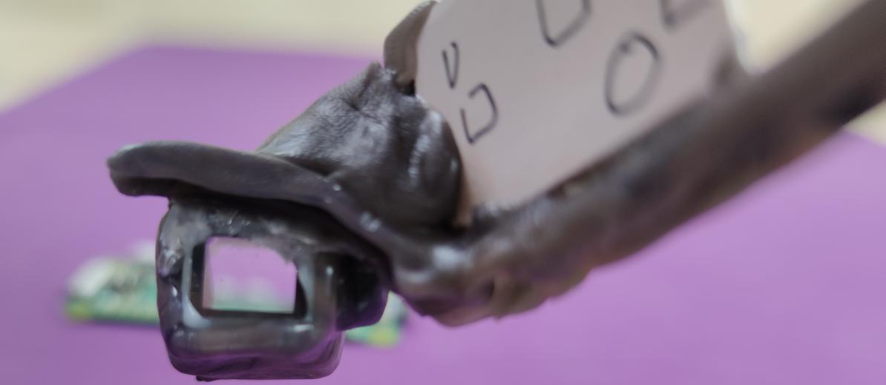

## Zbieramy części!

Mamy więc ekranik:
 

I, szczęśliwie, mamy też na co go nakładać:

To moje okulary na astygmatyzm, złączone ze słuchawkami Trekz Titanium. 
Jedyny sposób na wygodne noszenie ich razem, 
i naturalny kandydat na noszenie budowanej elektroniki.

A, i Malinka, oczywiście :)

## Makieta

Mając skompletowane części, nie chcę ich uszkodzić na etapie pomiarów.

Buduję więc makietę z tektury:

Składam tak by dobrze mi leżało...

I mamy wzór na złożenie prawdziwego sprzętu :)

Myślę że bardzo wiernie oddaje imitowane części.

Leży jak ulał!

Zarówno makieta, jak i przyszły produkt końcowy, są mocowane na wcisk/zatrzask, i w kilka sekund **zdejmowalne** z okularów. 

BTW, makietę zrobiłem dość ambitnie, z wizjera od taniego aparatu fotograficznego, by dawało wgląd na kąt widzenia ekranu przy oku :)

Prawdziwy ekranik nie jest przejrzysty.

