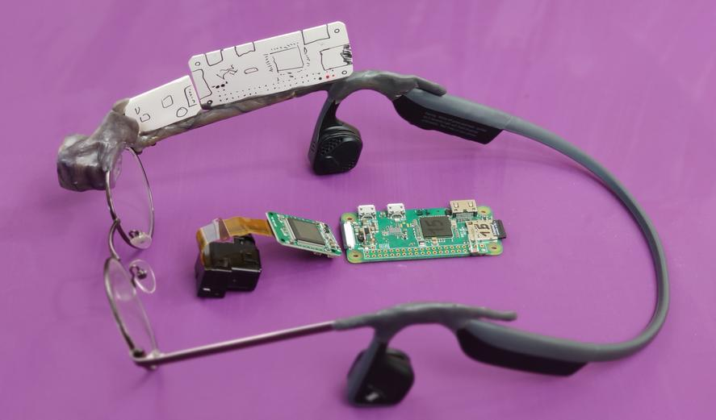

Mamy makietę i części do poukładania tak samo:

## Test "wizjera"
To supermały ekranik i soczewka. 

Urządzenie skierowane na stół, a pokazuje rozstawione na Hackerspace małe studio fotograficzne (dziękuję bardzo, Mirek :) ) widziane przez postawioną obok kamerkę WiFi (również z Raspberry Pi)

Postaram się (w końcu kiedyś) załączyć używany kod. 
Chodzi jednak o to, że pokazać tam można cokolwiek. To jest po prostu ekran komputera. 
Pokazuje obraz z kamerki, bo Raspberce tak kazano. Nie potrzeba nawet szczególnych sterowników, wyjście AV na 2 pinach na płytce jest w malinkowym standardzie.

Obraz nawet bardzo dobrej jakości!

Do tego ekran ma pokrętło regulacji ostrości - inaczej by obraz był ostry gdy patrzysz w książkę, inaczej gdy na coś kilka metrów od siebie. 
Typowo 1m jst OK.

## Lutujemy i składamy

{ dźwięki warsztatu }

I gotowe!

Tak, myślę że makieta dobrze oddawała jak to będzie wyglądać :)

Było dużo przymierzania i poprawiania by kąt patrzenia na ekranik był dobry. 
Wizjer z makiety zaoszczędził tu trochę trudu, wymagał podobnych ustawień.