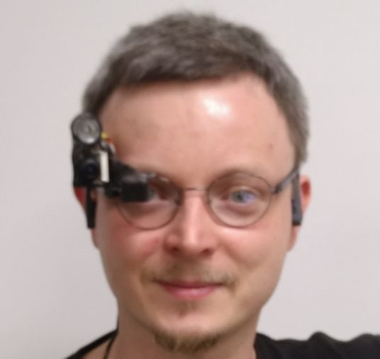
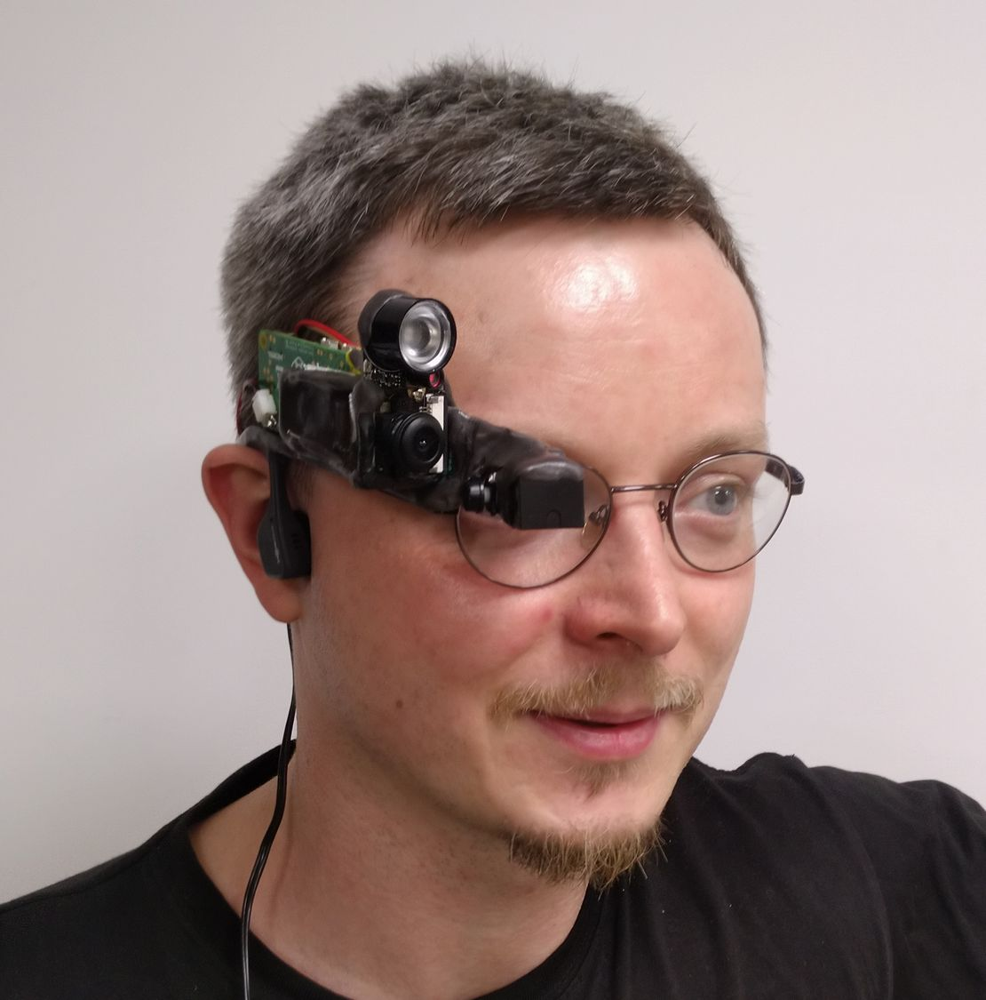
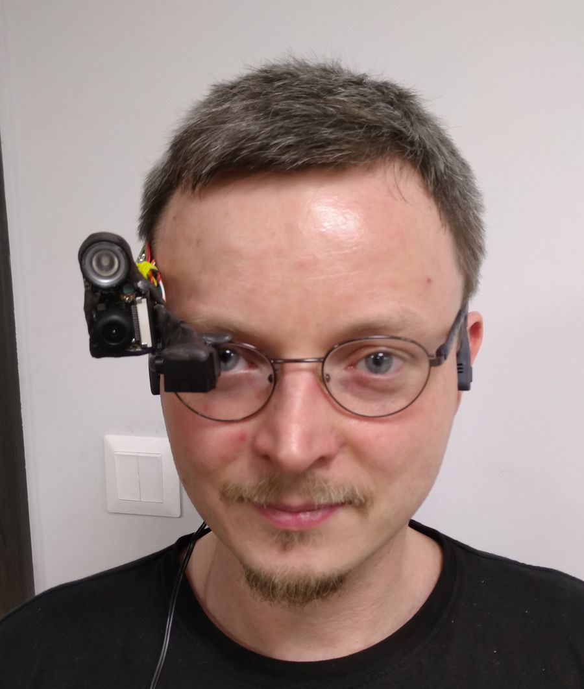

## Kamera

Mała odskocznia od planowanej termowizji

Użyta Raskberka ma gniazdo na kamerę (CSI), więc się tym pobawiłem - zmontowałem opcjonalny, zdejmowalny (wchodzi na hak i zatrzask) moduł kamerki :) 
 
 

Jest to standardowa malinkowa kamerka z soczewką ~120°, plus oświetlenie IR - takie do kamer NoIR. Jak ta :) 
Jasność LED zależy od tego jak jest ciemno.

Sklejone razem i uztywnione barwionym na szaro PCL.

Co to daje? Mogę widzieć przed okiem obraz z kamerki. 
Kamerki która sama jest przed okiem. 
... 
Z podświetleniem IR. No, jest jakaś wartość dodana :)

Super wygląda, nie?

Tylko takie...

... trochę...

... tak jakby...

 

... OK, to też, ale chciałem powiedzieć...

### ... duże.

## ZA****ŚCIE duże.

Sądzę zę to nie będzie docelowo częścią urządzenia.

Ale fajnie było się pobawić :)