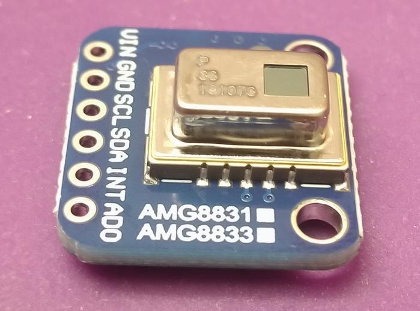

## STRONA NIE GOTOWA :(

Czeka na opis jak na [Hackathonie Hack4Change](https://hack4change.tech/) do ekraniku dodano to...

 

(Tak, to moduł termowizji, nie kamera IR a pomiar temperatury)

... by uzyskać to:

 

I oczywiście pokażę co przez to widzę!