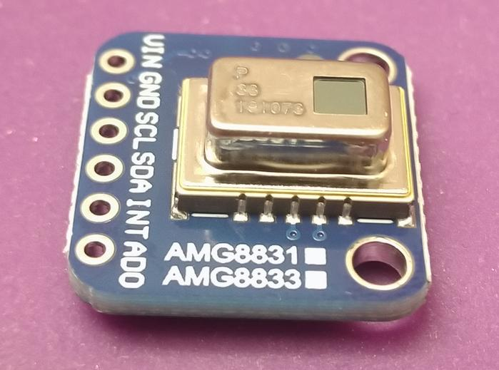
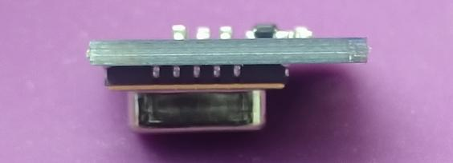
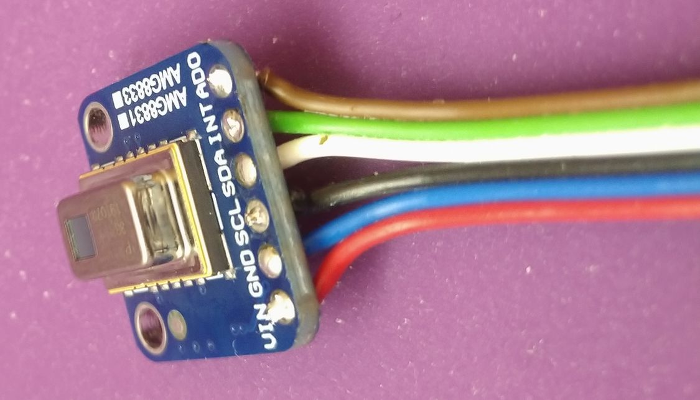
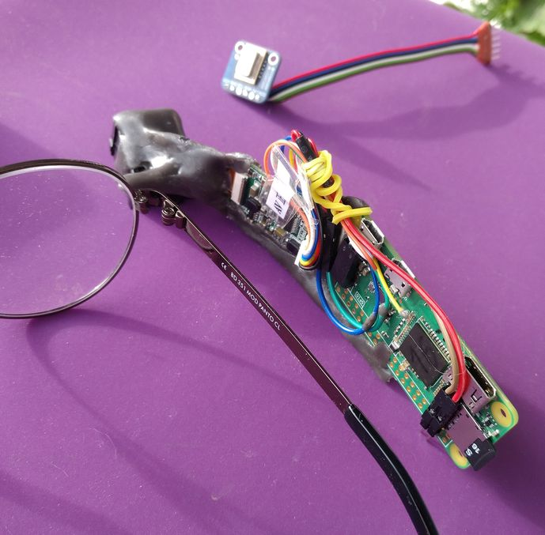
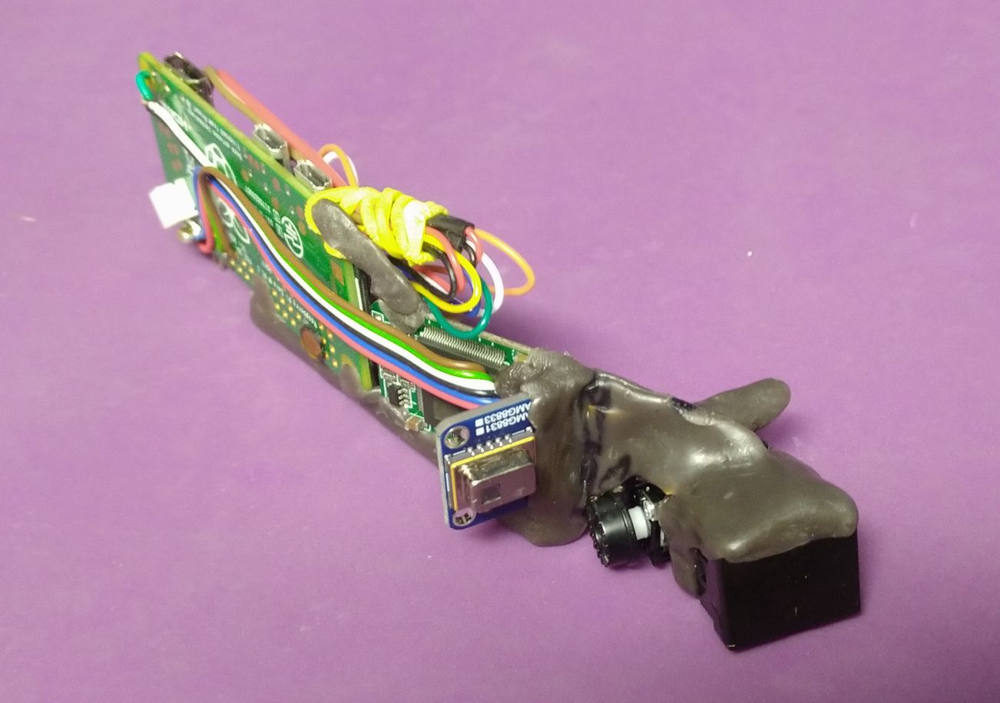
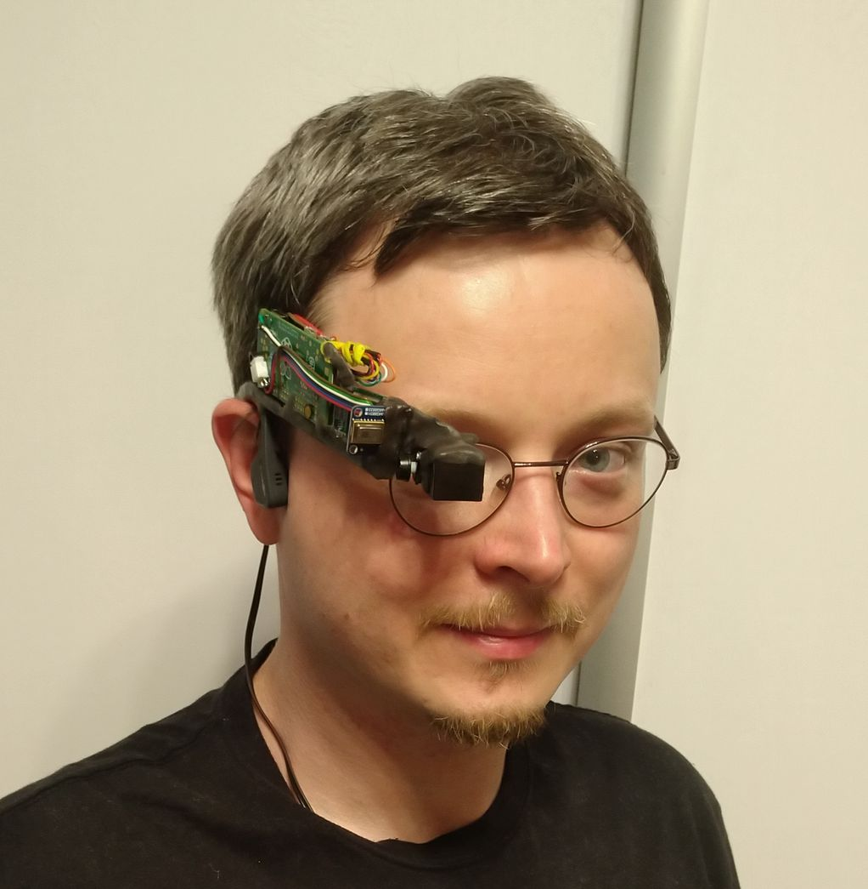
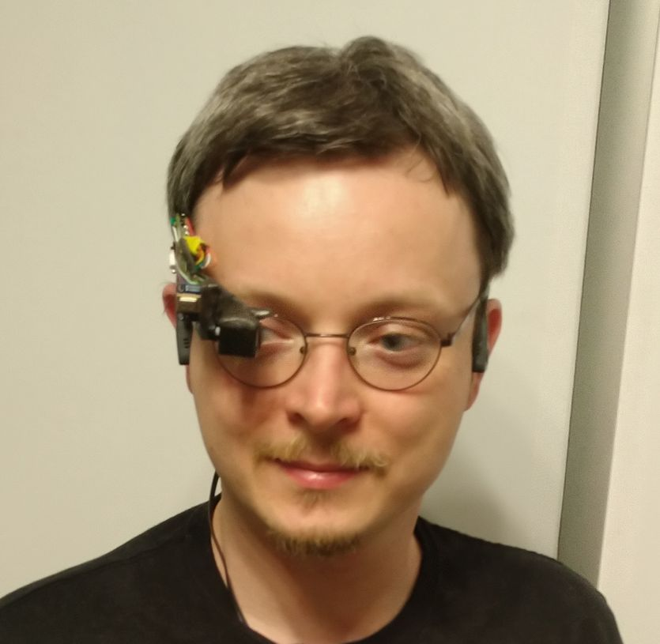
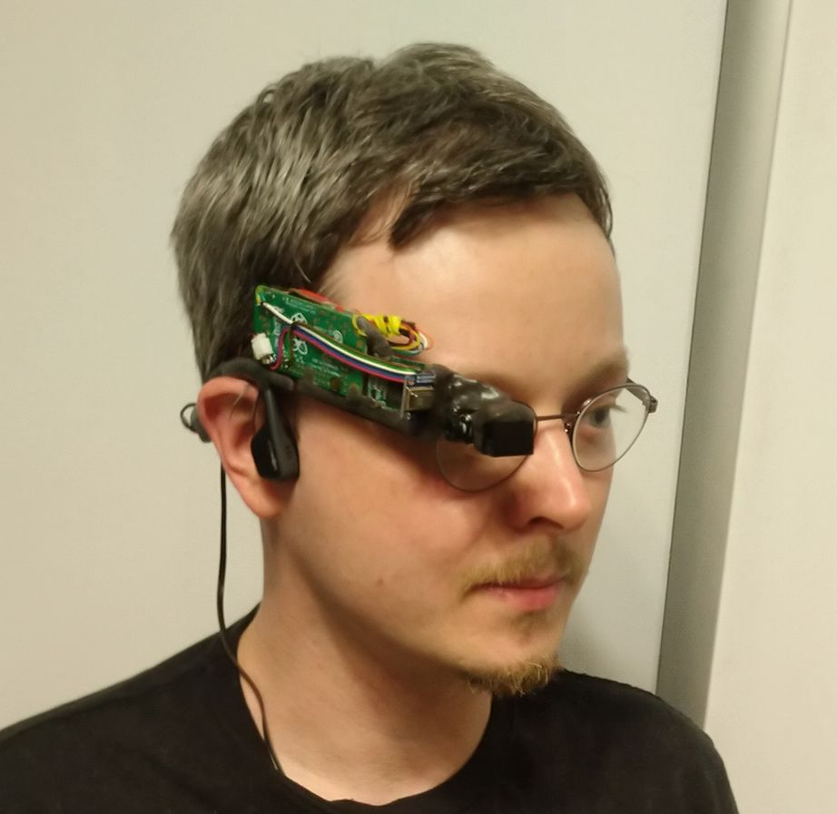
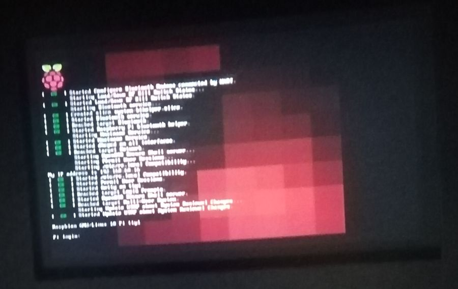
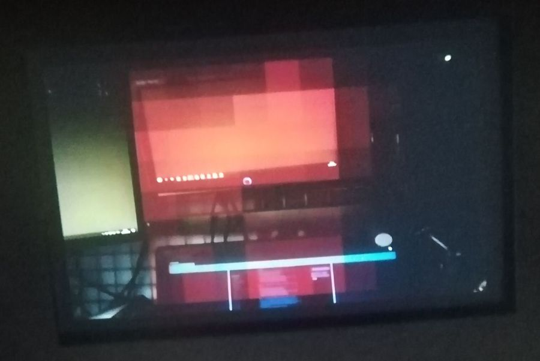

## Termowizja, wersja pierwsza

Oto jak na [Hackathonie Hack4Change](https://hack4change.tech/) do naokularnego ekraniku dodano to...

 

(To moduł termowizji, nie kamera IR a pomiar temperatury!)

... by uzyskać to:

 

To taki moduł:

 

Dolutowałem do niego kabelki...

 

... i połączyłem z tą nakładką na okulary :)

 

Po procedurze lutowania wygląda tak:

 

Ciut odstaje, ale to było nieuniknione.

 
 

A oto co przez wizjer można zobaczyć!

 

Może plama na terminalu mało wyjaśnia, więc zamontuję i włączę jeszcze kamerkę:

 

To pokazuje jeden z moich ekranów, i pod nim ekran laptopa 
Jak widać, oa trochę się grzeją :)

 

## Co dalej?

* polepszyć wyświetlanie - zakres kolorów zamiast intensywności samego czerwonego
* wyświetlać min/max/średnią temperaturę (pomiar z bliska jest dość precyzyjny, nie wiem, +- 2 stopnie?)
* przyspieszyć kod
