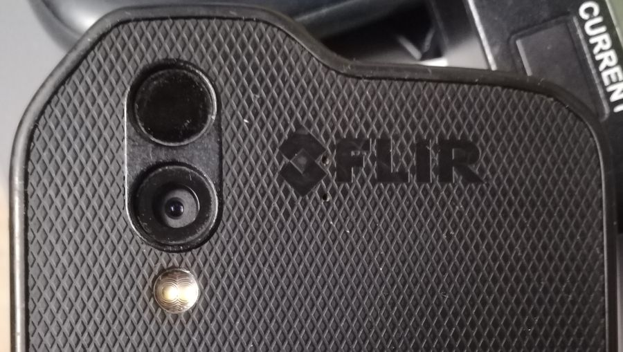
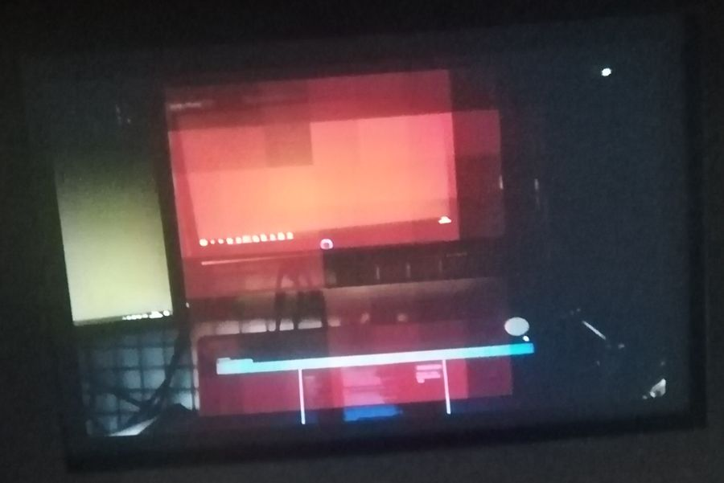
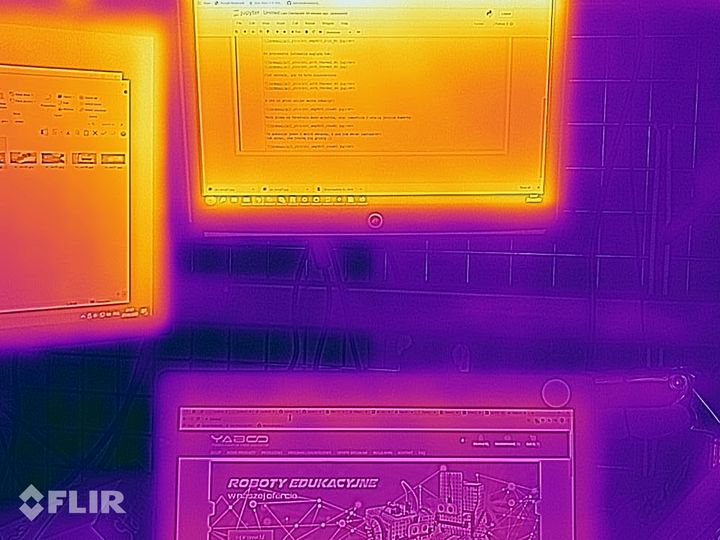
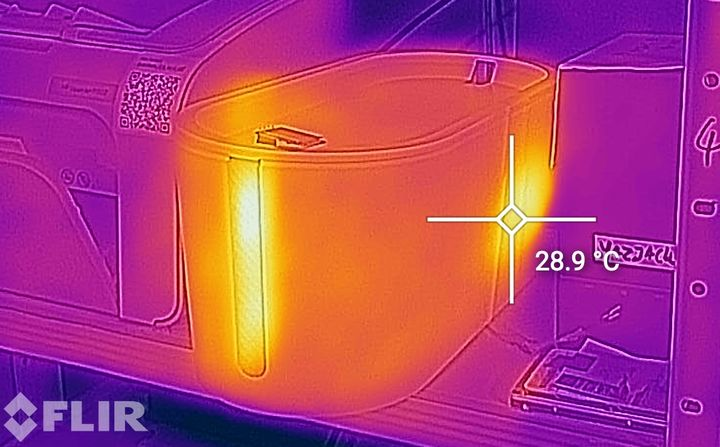

## Turbo termowizja ;)

AMG8833 jest fajne... ale ma rozdzielczość 8x8.

FLIR Lepton. Czterocyfrowa cena, niestety...

Ale są tańsze źródła :)

Mam to oto w swoim telefonie CAT S61:

Górna kamerka to właśnie Flir Lepton.

S60 jest b. drogi, ale jego poprzednik - antyczny CAT S60 - schodzi poniżej 700zł, czasem.

A w środku siedzi moduł taki sam jak można drożej kupić.

### Daczego Flir?

Pamiętacie widok z AMG8833? 
 
Pikseloza straszna.

To samo widziane FLIRem: 
 

Dużo więcej szczegółów widać :)

Przydatna rzecz:

 

## Zaczynamy więc robotę!

... gdy tylko znajdę tanio ten telefon do rozbiórki.

