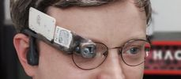
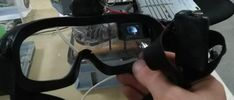
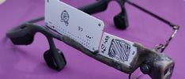
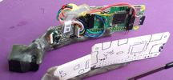
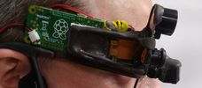
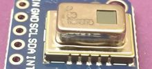
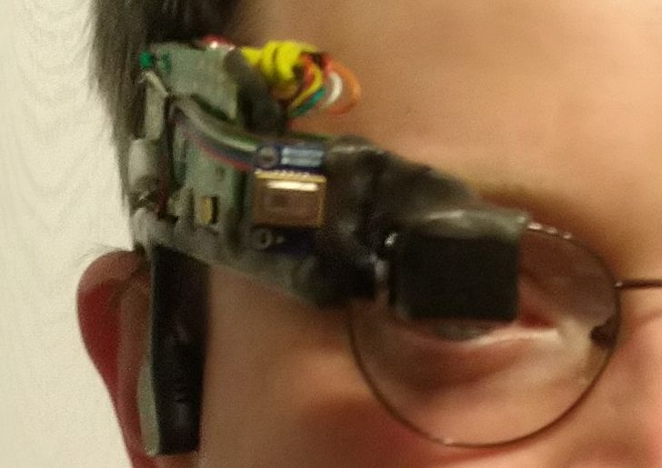

# rpi_wearable_screen
Raspberry Pi Zero W + microdisplay nad okiem

## Kim jestem?

## Opis projektu:

### [01_Intro:	Skąd pomysł](01_Intro.md)

### [02_Historia:	Pokonane perypetie](02_Historia.md)

### [03_Makieta:	Wzór kształtu](03_Makieta.md)

### [04_Realizacja:	Od makiety do gotowca](04_Realizacja.md)

### [05_Kamera:	Oko dla komputerka](05_Kamera.md)

### [06_Termowizja:	Dołożenie termowizji](06_Termowizja.md)

## Obecny stan:
Ten opis nie jest aktualizowany na bieżąco, lepiej mi się robi fajne rzeczy niż o tym pisze... 
Oto co mamy teraz (2020-06-23) 

 
Moduł termowizji nałożony na resztę w trakcie [Hackathonu Hack4Change](https://hack4change.tech/) 