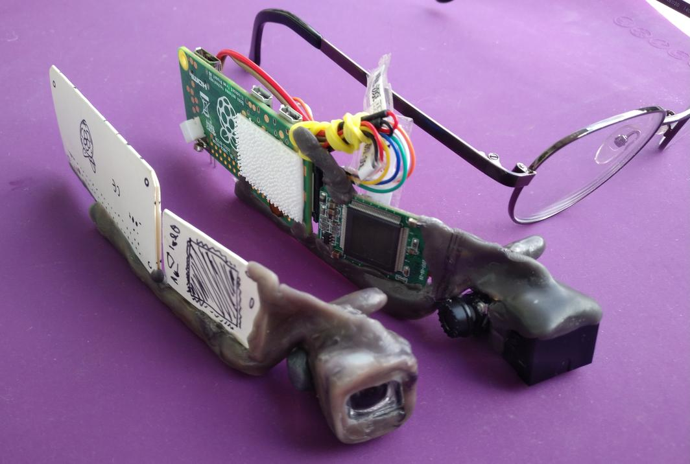

# rpi_wearable_screen
Raspberry Pi Zero W + microdisplay nad okiem

## Opis szczegółowy:

### [01_Intro](01_Intro.md)

Skąd pomysł

### [02_Historia](02_Historia.md)

Pokonane perypetie

### [03_Makieta](03_Makieta.md)

Wzór, jak ma wyglądać

## Obecny stan:
 (2020-06-23)

## Co następne:

Tak, to moduł TERMOWIZJI!
